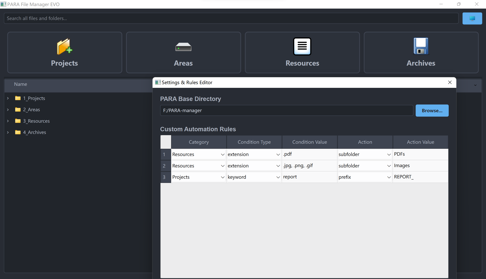

# 🚀 PARA File Manager EVO

A powerful, beautiful, and highly customizable file manager designed to supercharge your productivity using the PARA method. Drag, drop, and automate your way to a perfectly organized digital life.




## ✨ Features

This application is packed with features designed for both simplicity and power.

* **🗂️ Hybrid Drag & Drop Interface**

  * **Quick-File Zones:** Four large, always-visible drop zones at the top for instantly filing items into your Projects, Areas, Resources, or Archives.
  * **Precision Drops:** Drag files directly onto any folder within the detailed file browser for granular control.
* **🤖 Intelligent Automation Rules**

  * Create custom rules in a simple settings panel to automatically process your files.
  * **Auto-Prefixing:** Add prefixes to filenames based on keywords (e.g., `[REPORT]`).
  * **Auto-Subfolding:** Move files into specific subfolders based on their file type (e.g., all `.pdf` files go into a "PDFs" folder).
* **🌳 Real-Time Tree View Browser**

  * View your entire PARA folder structure in a clean, hierarchical tree view, just like a professional file explorer.
  * The view updates in real-time as files are added, moved, or changed on your disk.
* **⚡ Powerful Instant Search**

  * Find any file or folder across your entire PARA system instantly.
  * An in-memory index provides lightning-fast search results as you type, without slowing down the app.
  * Results are displayed in a clean, dedicated view for clarity.
* **🔧 Full File Control**

  * Right-click on any file or folder in the tree view to access a full context menu.
  * **Open** files with their default application.
  * **Show in File Explorer** (or Finder on macOS) to instantly locate the item.
  * **Rename** files and folders directly within the app.
  * **Safe Delete** items with a confirmation prompt.
* **🗑️ Safe Deletion**

  * Deleting a file doesn't permanently erase it. All deleted items are sent to your system's **Recycle Bin (or Trash)**, so you can always recover them if you make a mistake.
* **⚙️ Visual Settings Panel**

  * Easily configure the application through a user-friendly settings window.
  * Visually set your main PARA root folder using a file dialog.
  * Add, remove, and edit your automation rules using interactive dropdowns and text fields.
* **🚚 Smart Content Migration**

  * If you change your main PARA root directory in the settings, the application will **automatically move all your existing PARA folders and their contents** to the new location for you.
* **🎨 Modern, Polished Interface**

  * A clean, dark-themed UI with professional icons and dynamic hover effects provides a beautiful and efficient user experience.
  * A status bar provides clear, real-time feedback on all operations.

## 🚀 Getting Started

1. **Create Configuration Files:**

   * In the same directory as the application, create a file named `config.json`. Add the following, pointing to where you want your PARA folders to live:
     ```json
     {
       "base_directory": "C:/Users/YourUser/Documents/MyPARA"
     }
     ```
   * Create another file named `rules.json` to define your automations (or leave it as an empty list `[]` if you don't need any yet):
     ```json
     [
       {
         "category": "Resources",
         "condition_type": "extension",
         "condition_value": ".pdf",
         "action": "subfolder",
         "action_value": "PDFs"
       }
     ]
     ```
2. **Run the Application:**

   * Execute the `ParaManager.exe` file (if packaged) or run the script with Python. The application will automatically create the `1_Projects`, `2_Areas`, etc., folders in your specified base directory.
3. **Organize\!**

   * Start dragging files and folders into the drop zones or directly into the file tree to begin organizing.
