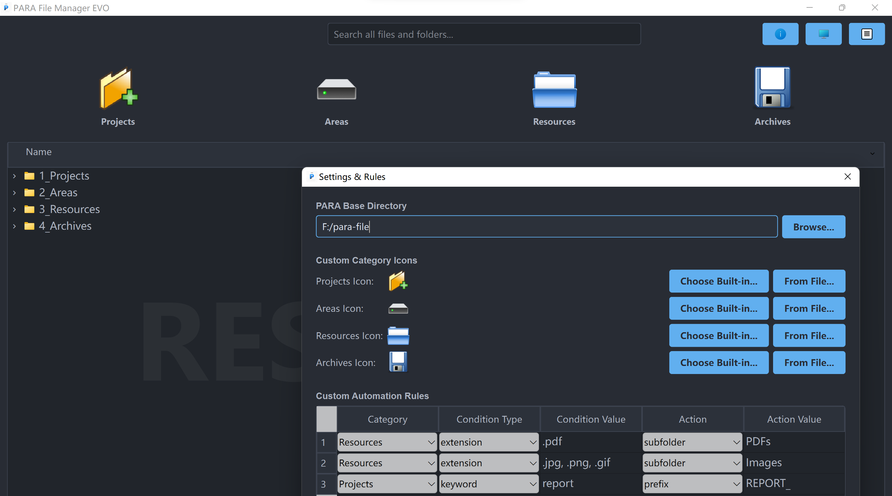

# 🚀 PARA File Manager EVO

Welcome to **PARA File Manager EVO**, a file organizer built to master the PARA method. This tool moves beyond simple file management by offering an intelligent, transparent, and highly automated workflow to bring true order to your life.

## ✨ Ultimate Features

This application is engineered for power users who demand clarity, control, and automation. It transforms the PARA method from a concept into a seamless, interactive experience.

* **🗂️ Hybrid Drag & Drop Interface**
  * **Quick-File Zones:** Four large, always-visible drop zones at the top for instantly filing items into your **P**rojects, **A**reas, **R**esources, or **A**rchives.
  * **Precision Drops:** Drag files directly onto any folder within the detailed file browser for granular control.

* **🤖 Intelligent Automation Engine**
  * Create custom rules in a simple settings panel to automatically process your files upon dropping them.
  * **Auto-Prefixing:** Add prefixes to filenames based on keywords (e.g., add `[REPORT]` to any file containing "summary").
  * **Auto-Subfolding:** Move files into specific subfolders based on their file type (e.g., all `.pdf` files go into a "PDFs" folder).

* **👁️ Transparent Deduplication Workflow**
  * **No More Black Boxes:** When moving files into a non-empty folder, the app clearly explains that duplicates might occur.
  * **User-Driven Choices:** You are given the choice between a **Smart Scan** (to check file content for duplicates) or a **Fast Move** (to simply move and rename any conflicts).
  * **Integrated Selection:** Instead of a separate pop-up, "Smart Scan" mode overlays **interactive checkboxes** directly onto the main file tree, so you can select which destination files to check against without losing context.

* **⚡ Fine-Grained Progress & Logging**
  * A single, continuous progress bar shows the total workload and updates with the **name of the specific file** currently being processed (hashed, checked, or moved).
  * A comprehensive log records every key action, from starting a hash to finding a duplicate and processing the user's final choice. The **Log Viewer** allows you to review these detailed logs at any time.

* **🌳 Full File & System Control**
  * **Full Context Menu:** Right-click any file or folder to Open, Show in Explorer, Rename, or Delete.
  * **Safe Deletion:** All deleted items are sent to the system's **Recycle Bin (or Trash)**, ensuring you can always recover from a mistake.
  * **Interactive Duplicate Resolution:** In the final confirmation dialog, you can right-click on both the source and conflicting destination files to **open their locations directly** for easy inspection before making a decision.

* **⚙️ Effortless Configuration**
  * A clean, visual settings panel allows you to set your main PARA directory and manage all automation rules with interactive dropdowns and text fields.
  * **Smart Migration:** If you ever change your PARA base directory, the app offers to **automatically move all existing folders and their contents** to the new location.

## 🚀 Getting Started

1. **Run the Application:**
    * Execute `ParaManager.exe` (or your platform's equivalent).
    * On first launch, you'll see a welcome screen. Click "Open Settings."

2. **Set Your Base Directory:**
    * In the settings window, click "Browse..." and choose an empty folder where you want your PARA structure to live (e.g., `C:/Users/YourUser/Documents/MyPARA`).
    * Click "Save & Close." The application will automatically create the `1_Projects`, `2_Areas`, `3_Resources`, and `4_Archives` folders for you.

3. **(Optional) Add Automation Rules:**
    * Open settings again to add rules. For example, to move all `.pdf` files dropped into "Resources" to a "PDFs" subfolder:
        * **Category:** Resources
        * **Condition Type:** extension
        * **Condition Value:** .pdf
        * **Action:** subfolder
        * **Action Value:** PDFs

4. **Organize!**
    * You're all set! Start dragging files and folders into the drop zones or directly into the file tree to experience automated, intelligent organization.
